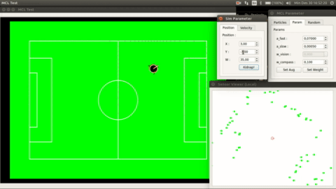
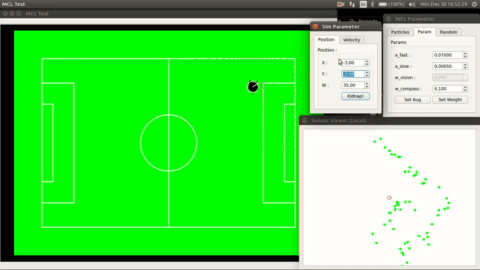

## Robosoccer Monte Carlo Localization
This repo shows my implementation (in robot soccer context) of Augmented Monte Carlo Localization algortihm as described by Sebastian Thrun *et al.* in 
> Thrun, Sebastian, Wolfram Burgard, and Dieter Fox. *Probabilistic Robotics*. MIT Press, 2005.

### Demo
| self-correction                   	| kidnapped recovery                 	|
|-----------------------------------	|------------------------------------	|
|  	|  	|
   
click any [of](https://www.youtube.com/watch?v=tMeLSQvUeVQ) [this](https://www.youtube.com/watch?v=ujVcfG9VXiw) [link](https://www.youtube.com/watch?v=SXniPrJiX9Q) to watch full videos.

### You'll Need
* Qt (with `gamepad` support)
* c++

#### tested on
* ubuntu 16.04 (with intel i3 @ 2.0 GHz)
* Qt 5.7 with `gamepad`
* gcc 7.4
